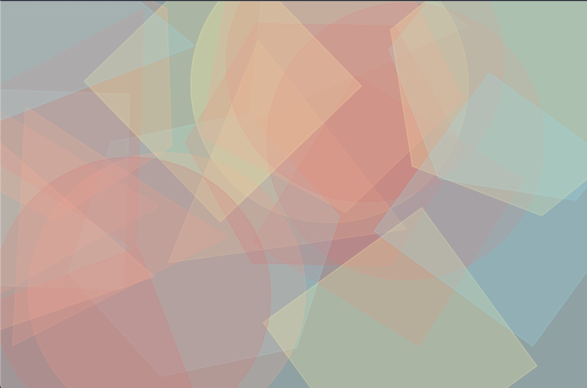

# geometric-paint-worklet
An interactive CSS Paint Worklet that renders geometric figures to the background of any element

---
### Table of contents
[1. What are CSS Paint Worklets](#-1-what-are-csspaint-worklets)

[2. How to use](#-2-how-to-use)

[3. How to customize](#-3-how-to-customize)

[4. CSS Variables](#-4-css-variables)

[5. Examples](#-5-examples)

---

## 🧪 1. What are CSSPaint Worklets?
CSS Paint Worklets are part of the CSS Paint API (also known as “CSS Custom Paint” or “Houdini’s paint worklet”) which allow us to programmatically generate an image that we can then use on any CSS property that expects an image (`background-image`, `border-image`, ...).

[CSS Paint API article](https://developers.google.com/web/updates/2018/01/paintapi#:~:text=CSS%20Paint%20API%20(also%20known,default%20starting%20in%20Chrome%2065.&text=CSS%20Paint%20API%20allows%20you,CSS%20property%20expects%20an%20image.
) on the developers.google.com


> ⚠️ **CSS Paint API features are experimental**: Maybe you need to take a look at the [CSS Paint Polyfill](https://github.com/GoogleChromeLabs/css-paint-polyfill)

---

## 📦 2. How to use
1. Copy the `dist/geomatric-paint-worklet.js` file into your project
2. Add the paint worklet module to your index.html:
```html
<script>
    CSS.paintWorklet.addModule('PATH_TO_YOUR_FILE/geometric-paint-worklet.js');
</script>
```
3. Use the GeometricPaintWorklet on any Element. Ex:
```css
.my-element {
    background-image: paint(geometricPaintWorklet);
}
```
4. Customize it to your needs using custom CSS Variables (see below)

---

## 💈 3. How to customize
You can customize it using css variables. Ex:
```css
.nice-element {
    --gpw-number-of-shapes: 32;
    --gpw-shape-size: 16;
    --gpw-line-width: 2;
    --gpw-possible-colors: ['#E57373', 'pink', 'rgb(100, 150, 34)'];
    --gpw-opacity: .25;
    
    background-image: paint(geometricPaintWorklet);
}
```

---

## 🦖 4. CSS Variables
| Variable                  | Value Type    | Default  |
| ------------------------- |:------------- | :--------|
| `--gpw-number-of-shapes`  | number        | 12       |
| `--gpw-shape-size`        | number        | 40       |
| `--gpw-line-width`        | number        | 40       |
| `--gpw-possible-colors`   | array         | ['#FFF59D', '#FFAB91', '#80DEEA', '#E57373']      |
| `--gpw-fill-shapes`       | boolean       | false    |
| `--gpw-opacity`           | number        | 1        |

---

## 📸 5. Examples
1. Default Settings
```css
.my-element {
    background-image: paint(geometricPaintWorklet);
}
```


2. Small shapes
```css
.my-element {
    --gpw-number-of-shapes: 80;
    --gpw-shape-size: 6;
    --gpw-line-width: 6;
    --gpw-fill-shapes: false;
    --gpw-opacity: .5;

    background-image: paint(geometricPaintWorklet);
}
```


3. Overlapping translucent forms
```css
.my-element {
    --gpw-number-of-shapes: 24;
    --gpw-shape-size: 256;
    --gpw-line-width: 1;
    --gpw-fill-shapes: true;
    --gpw-opacity: .25;

    background-image: paint(geometricPaintWorklet);
}
```


4. Large thin borders
```css
.my-element {
    --gpw-number-of-shapes: 8;
    --gpw-shape-size: 240;
    --gpw-line-width: 1;
    --gpw-possible-colors: ['#ffffff'];
    
    background-image: paint(geometricPaintWorklet);
}
```


5. Solid colourful shapes
```css
.my-element {
    --gpw-number-of-shapes: 12;
    --gpw-shape-size: 40;
    --gpw-line-width: 40;

    background-image: paint(geometricPaintWorklet);
}
```


---

😀 Have fun with it, and let me know if you use it somewhere...
